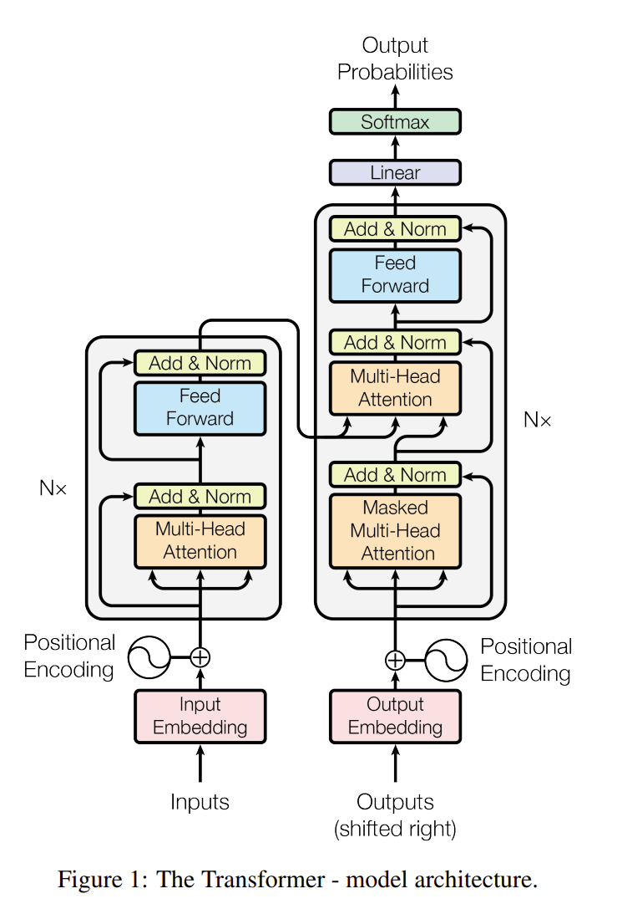

# Paper Reading 1: Transformers
2023-08-14, read the paper Attention Is All You Need, the aim is to cultivate paper reading skills and grasp important ideas and understand details from scratch.
## Attention Is All You Need
I read this paper with the following sequence:  
1. Title + Author (first page of the paper)
2. Abstract(first page of the paper)
3. Conclusion(part 7 of the paper)
4. Introduction(part 1 of the paper)
5. Background(part 2 of the paper)
6. Model Architecture, Why Self-Attention(part 3+4)
7. Training(part 5)
8. Results(part 6)
9. References

### 1. Title + Author
This paper uses equal contribution for all the authors, with a superscript star, meaning the listing order of authors is random.

### 2. Abstract  
First summerize the modern encoder-decoder with attention for rnn or cnn. Then propose their new architecture, the Transformer with only attention mechanisms. And shows how well the new architecture performs by achiving a higher BLEU and short training time.

### 3.Conclusion
The conclusion part highlights the new idea of this paper, the Transformer with 2 merits:
1. based solely on attention;
2. replacing the layers in encoder-decoder architectures with multi-head self-attention. 

This paper addresses the source code in the Conclusion part. Perhaps placing the source code in the Abstract would be a more popular way.

Personal Thinking: Abstracts and Conclusions are the concise descriptions of the paper, and tell us what they have accomplished, and whether this paper is what I am looking for. If not, go and search for another one.

### 4. Introduction
In this paper, the introduction part is not long, which can be regarded as an extensive part of the abstract. The introduction first introduces the rnn and encoder-decoder architecture, and their limitations and drawbacks:
1. memory constraints and sequential computation as the steps grow
2. still not enough of parallelization
3. dependencies regard to distance in the input or output sequences

The Transformer architecture addresses those three problems significantly.

NeurlIPS are of short papers, perhaps this is the reason that this paper is so concise.

### 5.Background
The background part first mentions works of cnn to overcome input and output parallelism, but operations grow in these networks, making it difficult to learn dependencies between distant positions. The Transformer architecture solves this problem by counteracting with multi-head attention.

Self-attention is not newly proposed mechanism in this paper, but from others' work.

End-to-end memory network was a hot research area in 2017(not so important in this paper though).

Transformer architecture is the first transduction model based entirely on self-attention.

Personal Thinking: Background part mainly discusses works that are relative to this paper, what the relations are and why is this paper different.

### 6.Model Architecture, Why Self-Attention
Model Architecture part is the essential part of almost every DNN paper.

A good picture is better than thousand words. Auto-regressive stands for the current output depends linearly on its own previuos values and input at this step.

#### The Transformer architecture mainly consists of two parts:
1. the encoder(left half of the picture)
2. the decoder(right half of the picture)

Encoder part:  
N = 6 identical layers compose the encoder. Each identical layer has two sub-layers:   
1. multi-head self-attention mechanism, residual connection + layer norm
2. simple feed forword MLP, residual connection + layer norm  
output dimension dmodel = 512.

Decoder part:  
N = 6 identical layers compose the decoder. Each layer has three sub-layers:
1. masked multi-head attention(masked here ensures that the predictions for position i only depend on the known previous outputs.), residual connection + layer norm
2. multi-head self-attention mechanism, residual connection + layer norm, the input comes from the encoder and the decoder
3. simple feed forword MLP, residual connection + layer norm  

Questions:  
1. the hyperparameters of Transformer model are N(the number of layers in the encoder and decoder), and the output dimension dmodel. 
2. Three things need to figure out:  
    (1). what is attention, self-attention, multi-head self-attention, their roles and computation process(scaled dot-product attention, multi-head attention).     
    (2). what is residual connection and its role  
    (3). what is layer normalization, and layer norm vs batch norm, pros and cons, and why use it  
    (4). what is BLUE score , how to compute it and when to use it? Is there any other eveluation methods?
    

#### Feed Forward MLP
The feed forward MLP consists of tow linear transformations with a ReLu activation:  FFN(x) = max(0, xW1+b1)W2 + b2

#### Embeddings and Softmax
Words are mapping to embeddings a inputs, the embeddings are usually L2Long normed, here those weights are multiplied by square root dmodel. The reason is to keep the embeddings to the similar scales when adding positional encodings, since positional encodings are not normed as the way embeddings would.

#### Positional Encoding
Add position information to the embeddings.

### 7.Training(part 5) + Results(part 6)
The experiments and results of the Transformer model.

### Appendix:
The answers of the questions:
