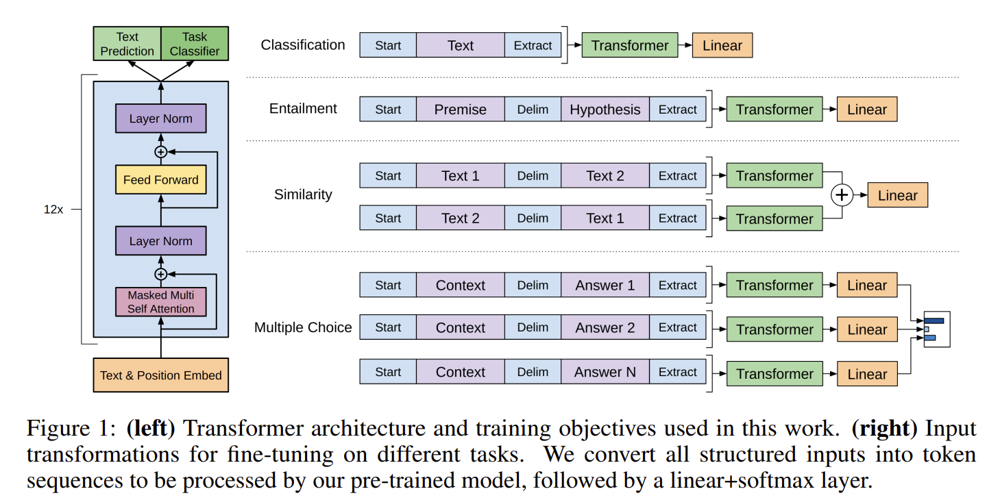

# Paper Reading 3: GPT
2023-08-21, Improving Language Understanding by Generative Pre-Training

## GPT: Improving Language Understanding by Generative Pre-Training
I read this paper by the following sequence:
1. Title + Authors
2. Abstract
3. Introduction
4. Conclusion
5. Related Work
6. GPT Model

### 2. Abstract
GPT aims at tackle language models' performance on abundant of unlabeled text. GPT is achieved through two steps:

1. generative pre-training of a language model on unlabeled texts
2. discriminative fine-tuning on each specific task.

GPT has achieved improvements in 9 out of 12 tasks.

### 3. Introduction
First, the paper describes the problem-most deep learning methods require manually labeled data-and word embedding has been the omst compelling tool used in NLP.

Secondly, there are two challenges in training unlabeled texts.

1. No well-defined generalized objective functions
2. How to transfer learned representations to specific tasks.

The paper points out that the current solutions are intricate and uncertain, making it hard to develop a semi-supervised approach.

To overcome these challenges, the paper proposes a combination of unsupervised pre-training and supervised fine-tuning, by using Transformer's decoder structure and defing two objectives for each step.

### 4. Conclusion
The paper mainly focuses on improving the work of unsupervised learning, and introduced their model as a generative pre-training and discriminative fine-tunig framework.  
In the pre-training step, the model is able to capture long-range dependencies and transfer to discriminative tasks such as question answering, semantic similarity assessment, entailment determination and text classification.

### 5.Related Work
In this part, the paper main discusses what is going on in semi-supervised learning in NLP, unsupervised pre-training as well as auxiliary training objectives.

### 6.GPT Model
This is the most important part demonstrating the GPT architecture. In the previous sections, the paper mentions pre-training, fine-tuning and objective functions(also auxiliary function). They are expanded in the section.

#### Unsupervised Pre-training
The first stage-unsupervised pre-training, defines an objective to predict the next word given previous k words.

Phi represents for the model used in the architecture, which is a multi-layer transformer decoder followed by a softmax.

where h0 consists of the word embedding plus the position embedding matrix.

Personal thinking: From the model structure so far, we can see that GPT is different from BERT in several aspects:

1. BERT fills in the blank in a given context(encoder), while GPT predicts the next word(decoder), which is conceptually more difficult since only previous information can be derived.

2. The objective functions are different between them. GPT is going to predict the future(words), BERT captures the sentence relations.

#### Supervised Fine-tuning
This part can be a standard language model, given the input sequences, predict the output(classification problem). 

So far, the paper demonstrates the stages for this model and defination of the objectives, but one thing remains to illustrate-the input and output of this model(defination of specific tasks).

#### Task-specific transformations

There are four types of tasks. Their inputs have been showed in the figure, while their inputs can be different, the model(transformer) blocks remain the same. That's why minimal changes should be made for each specific tasks.
